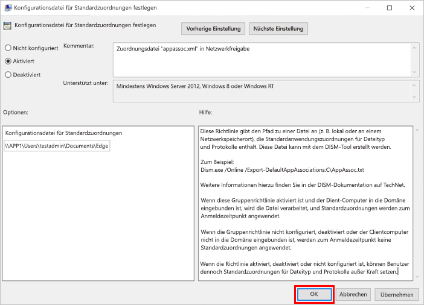

# <a name="set-microsoft-edge-as-the-default-browser"></a><span data-ttu-id="cb1f4-103">Festlegen von Microsoft Edge als Standardbrowser</span><span class="sxs-lookup"><span data-stu-id="cb1f4-103">Set Microsoft Edge as the default browser</span></span>

<span data-ttu-id="cb1f4-104">In diesem Artikel wird erläutert, wie Sie Microsoft Edge als Standardbrowser unter Windows und macOS festlegen können.</span><span class="sxs-lookup"><span data-stu-id="cb1f4-104">This article explains how you can set Microsoft Edge as the default browser on Windows and macOS.</span></span>

> [!NOTE]
> <span data-ttu-id="cb1f4-105">Dieser Artikel bezieht sich auf Microsoft Edge Version 77 oder höher unter Windows 8 und Windows 10.</span><span class="sxs-lookup"><span data-stu-id="cb1f4-105">This article applies to Microsoft Edge version 77 or later on Windows 8 and Windows 10.</span></span> <span data-ttu-id="cb1f4-106">Informationen zu Windows7 und macOS finden Sie in der Richtlinie [Festlegen von Microsoft Edge als Standardbrowser](./microsoft-edge-policies.md#defaultbrowsersettingenabled).</span><span class="sxs-lookup"><span data-stu-id="cb1f4-106">For Windows 7 and macOS, see the [Set Microsoft Edge as default browser](./microsoft-edge-policies.md#defaultbrowsersettingenabled) policy.</span></span>

## <a name="introduction"></a><span data-ttu-id="cb1f4-107">Einführung</span><span class="sxs-lookup"><span data-stu-id="cb1f4-107">Introduction</span></span>

<span data-ttu-id="cb1f4-108">Sie können die Gruppenrichtlinie **Konfigurationsdatei für Standardzuordnungen festlegen** bzw. die MDM-Einstellung [DefaultAssociationsConfiguration](/windows/client-management/mdm/policy-csp-applicationdefaults#applicationdefaults-defaultassociationsconfiguration) für Mobilgeräteverwaltung verwenden, um Microsoft Edge als Standardbrowser für Ihre Organisation festzulegen.</span><span class="sxs-lookup"><span data-stu-id="cb1f4-108">You can use the **Set a default associations configuration file** Group Policy or the [DefaultAssociationsConfiguration](/windows/client-management/mdm/policy-csp-applicationdefaults#applicationdefaults-defaultassociationsconfiguration) Mobile Device Management setting to set Microsoft Edge as the default browser for your organization.</span></span>

<span data-ttu-id="cb1f4-109">Verwenden Sie das folgende Beispiel für eine Anwendungszuordnungsdatei, um Microsoft Edge Stable als Standardbrowser für HTML-Dateien, http- bzw. https-Links und PDF-Dateien festzulegen:</span><span class="sxs-lookup"><span data-stu-id="cb1f4-109">To set Microsoft Edge Stable as the default browser for html files, http/https links, and PDF files use the following application association file example:</span></span>

```xml
<?xml version="1.0" encoding="UTF-8"?>
<DefaultAssociations> 
  <Association ApplicationName="Microsoft Edge" ProgId="MSEdgeHTM" Identifier=".html"/>
  <Association ApplicationName="Microsoft Edge" ProgId="MSEdgeHTM" Identifier=".htm"/>
  <Association ApplicationName="Microsoft Edge" ProgId="MSEdgeHTM" Identifier="http"/>
  <Association ApplicationName="Microsoft Edge" ProgId="MSEdgeHTM" Identifier="https"/>  
  <Association ApplicationName="Microsoft Edge" ProgId="MSEdgePDF" Identifier=".pdf"/>
</DefaultAssociations>
```

> [!NOTE]
> <span data-ttu-id="cb1f4-110">Wenn Sie Microsoft Edge Beta als Standardbrowser festlegen möchten, legen Sie **ApplicationName** auf „Microsoft Edge Beta” und **ProgId** auf „MSEdgeBHTML” fest.</span><span class="sxs-lookup"><span data-stu-id="cb1f4-110">To set Microsoft Edge Beta as the default browser, set **ApplicationName** to "Microsoft Edge Beta" and **ProgId** to "MSEdgeBHTML".</span></span> <span data-ttu-id="cb1f4-111">Wenn Sie Microsoft Edge Dev als Standardbrowser festlegen möchten, legen Sie **ApplicationName** auf „Microsoft Edge Dev” und **ProgId** auf „MSEdgeDHTML” fest.</span><span class="sxs-lookup"><span data-stu-id="cb1f4-111">To set Microsoft Edge Dev as the default browser, set **ApplicationName** to "Microsoft Edge Dev" and **ProgId** to "MSEdgeDHTML".</span></span>


> [!NOTE]
> <span data-ttu-id="cb1f4-112">Die Standarddateizuordnungen werden nicht angewendet, wenn Microsoft Edge nicht auf dem Zielgerät installiert ist.</span><span class="sxs-lookup"><span data-stu-id="cb1f4-112">The default file associations aren't applied if Microsoft Edge isn't installed on the target device.</span></span> <span data-ttu-id="cb1f4-113">In diesem Szenario werden Benutzer aufgefordert, ihre Standardanwendung auszuwählen, wenn Sie einen Link oder eine HTM/HTML-Datei öffnen.</span><span class="sxs-lookup"><span data-stu-id="cb1f4-113">In this scenario, users are prompted to select their default application when they open a link or a htm/html file.</span></span>

## <a name="set-microsoft-edge-as-the-default-browser-on-domain-joined-devices"></a><span data-ttu-id="cb1f4-114">Festlegen von Microsoft Edge als Standardbrowser</span><span class="sxs-lookup"><span data-stu-id="cb1f4-114">Set Microsoft Edge as the default browser on domain-joined devices</span></span>

<span data-ttu-id="cb1f4-115">Sie können Microsoft Edge auf Geräten mit Domänenbeitritt als Standardbrowser festlegen, indem Sie die Gruppenrichtlinie **Standardzuordnungskonfigurationsdatei festlegen** konfigurieren.</span><span class="sxs-lookup"><span data-stu-id="cb1f4-115">You can set Microsoft Edge as the default browser on domain-joined devices by configuring the **Set a default associations configuration file** group policy.</span></span> <span data-ttu-id="cb1f4-116">Wenn Sie diese Einstellung aktivieren, müssen Sie eine Konfigurationsdatei für Standardzuordnungen erstellen und sie lokal oder auf einer Netzwerkfreigabe speichern.</span><span class="sxs-lookup"><span data-stu-id="cb1f4-116">Turning this group policy on requires you to create and store a default associations configuration file.</span></span> <span data-ttu-id="cb1f4-117">Diese Datei wird lokal oder auf einer Netzwerkfreigabe gespeichert.</span><span class="sxs-lookup"><span data-stu-id="cb1f4-117">This file is stored locally or on a network share.</span></span> <span data-ttu-id="cb1f4-118">Weitere Informationen zum Erstellen dieser Datei finden Sie unter [Exportieren und Importieren von Standardanwendungszuordnungen](/windows-hardware/manufacture/desktop/export-or-import-default-application-associations).</span><span class="sxs-lookup"><span data-stu-id="cb1f4-118">For more information about creating this file, see [Export or Import Default Application Associations](/windows-hardware/manufacture/desktop/export-or-import-default-application-associations).</span></span>

### <a name="to-configure-the-group-policy-for-a-default-file-type-and-protocol-associations-configuration-file"></a><span data-ttu-id="cb1f4-119">So konfigurieren Sie die Gruppenrichtlinie für eine Standardkonfigurationsdatei und eine Konfigurationsdatei für Protokollzuordnungen:</span><span class="sxs-lookup"><span data-stu-id="cb1f4-119">To configure the group policy for a default file type and protocol associations configuration file:</span></span>

1. <span data-ttu-id="cb1f4-120">Öffnen Sie den Editor für lokale Gruppenrichtlinien und wechseln Sie zu **Computerkonfiguration\Administrative Vorlagen\Windows-Komponenten\Datei-Explorer**.</span><span class="sxs-lookup"><span data-stu-id="cb1f4-120">Open the Group Policy editor and go to the **Computer Configuration\Administrative Templates\Windows Components\File Explorer**.</span></span>
2. <span data-ttu-id="cb1f4-121">Wählen Sie **Konfigurationsdatei für Standardzuordnungen festlegen** aus.</span><span class="sxs-lookup"><span data-stu-id="cb1f4-121">Select **Set a default associations configuration file**.</span></span>
3. <span data-ttu-id="cb1f4-122">Klicken Sie auf **Richtlinieneinstellung** und dann auf **Aktiviert**.</span><span class="sxs-lookup"><span data-stu-id="cb1f4-122">Click **policy setting**, and then click **Enabled**.</span></span>
4. <span data-ttu-id="cb1f4-123">Klicken Sie auf **Aktiviert**, und geben Sie im Bereich Optionen den Speicherort Ihrer Konfigurationsdatei für Standardzuordnungen ein.</span><span class="sxs-lookup"><span data-stu-id="cb1f4-123">Under **Options:**, type the location to your default associations configuration file.</span></span>
5. <span data-ttu-id="cb1f4-124">Klicken Sie auf **OK**, um die Richtlinie zu speichern.</span><span class="sxs-lookup"><span data-stu-id="cb1f4-124">Click **OK** to save the policy settings.</span></span>

<span data-ttu-id="cb1f4-125">Das Beispiel im nächsten Screenshot zeigt eine Zuordnungsdatei mit dem Namen *appassoc.xml* auf einer Netzwerkfreigabe, auf die vom Zielgerät aus zugegriffen werden kann.</span><span class="sxs-lookup"><span data-stu-id="cb1f4-125">The example in the next screenshot shows an associations file named *appassoc.xml* on a network share that is accessible from the target device.</span></span>

   

   > [!NOTE]
   > <span data-ttu-id="cb1f4-127">Wenn diese Einstellung aktiviert ist und das Gerät des Benutzers einer Domäne angehört, wird die Konfigurationsdatei für Zuordnungen bei der nächsten Anmeldung des Benutzers verarbeitet.</span><span class="sxs-lookup"><span data-stu-id="cb1f4-127">If this setting is enabled and the user's device is domain-joined, the associations configuration file is processed the next time the user signs on.</span></span>

## <a name="set-microsoft-edge-as-the-default-browser-on-azure-active-directory-joined-devices"></a><span data-ttu-id="cb1f4-128">Festlegen von Microsoft Edge als Standardbrowser auf verbundenen Azure Active Directory-Geräten</span><span class="sxs-lookup"><span data-stu-id="cb1f4-128">Set Microsoft Edge as the default browser on Azure Active Directory joined devices</span></span>

<span data-ttu-id="cb1f4-129">Um Microsoft Edge Beta als Standardbrowser auf verbundenen Azure Active Directory-Geräten festzulegen, führen Sie die Schritte in der Einstellung [DefaultAssociationsConfiguration](/windows/client-management/mdm/policy-csp-applicationdefaults#applicationdefaults-defaultassociationsconfiguration) für die Mobile Geräteverwaltung anhand des folgenden Beispiels für eine Anwendungszuordnungsdatei aus.</span><span class="sxs-lookup"><span data-stu-id="cb1f4-129">To set Microsoft Edge as the default browser on Azure Active Directory joined devices follow the steps in the [DefaultAssociationsConfiguration](/windows/client-management/mdm/policy-csp-applicationdefaults#applicationdefaults-defaultassociationsconfiguration) Mobile Device Management setting using the following application association file as an example.</span></span>

```xml
<?xml version="1.0" encoding="UTF-8"?>
<DefaultAssociations>
  <Association ApplicationName="Microsoft Edge" ProgId="MSEdgeHTM" Identifier=".html"/>
  <Association ApplicationName="Microsoft Edge" ProgId="MSEdgeHTM" Identifier=".htm"/>
  <Association ApplicationName="Microsoft Edge" ProgId="MSEdgeHTM" Identifier="http"/>
  <Association ApplicationName="Microsoft Edge" ProgId="MSEdgeHTM" Identifier="https"/>  
  <Association ApplicationName="Microsoft Edge" ProgId="MSEdgePDF" Identifier=".pdf"/>
</DefaultAssociations>
```

> [!NOTE]
> <span data-ttu-id="cb1f4-130">Wenn Sie Microsoft Edge Beta als Standardbrowser festlegen möchten, legen Sie **ApplicationName** auf „Microsoft Edge Beta” und **ProgId** auf „MSEdgeBHTML” fest.</span><span class="sxs-lookup"><span data-stu-id="cb1f4-130">To set Microsoft Edge Beta as the default browser, set **ApplicationName** to "Microsoft Edge Beta" and **ProgId** to "MSEdgeBHTML".</span></span> <span data-ttu-id="cb1f4-131">Wenn Sie Microsoft Edge Dev als Standardbrowser festlegen möchten, legen Sie **ApplicationName** auf „Microsoft Edge Dev” und **ProgId** auf „MSEdgeDHTML” fest.</span><span class="sxs-lookup"><span data-stu-id="cb1f4-131">To set Microsoft Edge Dev as the default browser, set **ApplicationName** to "Microsoft Edge Dev" and **ProgId** to "MSEdgeDHTML".</span></span>

## <a name="set-microsoft-edge-as-the-default-browser-on-macos"></a><span data-ttu-id="cb1f4-132">Festlegen von Microsoft Edge als Standardbrowser unter macOS</span><span class="sxs-lookup"><span data-stu-id="cb1f4-132">Set Microsoft Edge as the default browser on macOS</span></span>

<span data-ttu-id="cb1f4-133">Wenn Sie versuchen, den Standardbrowser programmgesteuert unter macOS festzulegen, wird eine Eingabeaufforderung für den Endbenutzer angezeigt.</span><span class="sxs-lookup"><span data-stu-id="cb1f4-133">Attempting to programmatically set the default browser on macOS causes a prompt to appear for the end user.</span></span> <span data-ttu-id="cb1f4-134">Diese Eingabeaufforderung ist ein macOS-Sicherheitsfunktion, das nur mithilfe eines AppleScripts automatisiert werden kann.</span><span class="sxs-lookup"><span data-stu-id="cb1f4-134">This prompt is a macOS security feature that can only be automated away by using an AppleScript.</span></span>

<span data-ttu-id="cb1f4-135">Aufgrund dieser Einschränkung gibt es zwei Hauptmethoden zum Festlegen von Microsoft Edge als Standardbrowser unter macOS.</span><span class="sxs-lookup"><span data-stu-id="cb1f4-135">Because of this limitation, there are two main methods for setting Microsoft Edge as the default browser on a macOS.</span></span> <span data-ttu-id="cb1f4-136">Die erste Methode besteht darin, das Gerät mit einem Image von macOS zu flashen, auf dem Microsoft Edge bereits als Standardbrowser festgelegt wurde.</span><span class="sxs-lookup"><span data-stu-id="cb1f4-136">The first option is to flash the device with an image of macOS where Microsoft Edge has already been set as the default browser.</span></span> <span data-ttu-id="cb1f4-137">Die zweite Methode ist die Verwendung der Richtlinie [Microsoft Edge als Standardbrowser festlegen](./microsoft-edge-policies.md#defaultbrowsersettingenabled) , die den Benutzer auffordert, Microsoft Edge als Standardbrowser festzulegen.</span><span class="sxs-lookup"><span data-stu-id="cb1f4-137">The other option is to use the [Set Microsoft Edge as default browser](./microsoft-edge-policies.md#defaultbrowsersettingenabled) policy, which prompts the user to set Microsoft Edge as the default browser.</span></span>

<span data-ttu-id="cb1f4-138">Bei Verwendung dieser Methoden können Benutzer den Standardbrowser weiterhin ändern.</span><span class="sxs-lookup"><span data-stu-id="cb1f4-138">When using either of these methods, it is still possible for a user to change the default browser.</span></span> <span data-ttu-id="cb1f4-139">Dies liegt daran, dass die Standardbrowsereinstellung aus Sicherheitsgründen nicht programmgesteuert gesperrt werden kann.</span><span class="sxs-lookup"><span data-stu-id="cb1f4-139">This is because for security reasons, the default browser preference can’t be blocked programmatically.</span></span> <span data-ttu-id="cb1f4-140">Aus diesem Grund empfiehlt es sich, die Richtlinie **Microsoft Edge als Standardbrowser festlegen** bereitzustellen, auch wenn Sie ein Image mit Microsoft Edge als Standardbrowser erstellen.</span><span class="sxs-lookup"><span data-stu-id="cb1f4-140">For this reason, we recommend that you deploy the **Set Microsoft Edge as default browser** policy even if you create an image with Microsoft Edge as the default browser.</span></span> <span data-ttu-id="cb1f4-141">Wenn die Richtlinie festgelegt ist und ein Benutzer den Standardbrowser von Microsoft Edge ändert, wenn er Microsoft Edge das nächste Mal öffnet, wird er aufgefordert, ihn als Standardbrowser festzulegen.</span><span class="sxs-lookup"><span data-stu-id="cb1f4-141">If the policy is set and a user changes the default browser from Microsoft Edge the next time they open Microsoft Edge, they will be prompted to set it as the default.</span></span>

## <a name="see-also"></a><span data-ttu-id="cb1f4-142">Weitere Informationen</span><span class="sxs-lookup"><span data-stu-id="cb1f4-142">See also</span></span>

- [<span data-ttu-id="cb1f4-143">Planen Ihrer Bereitstellung von Microsoft Edge</span><span class="sxs-lookup"><span data-stu-id="cb1f4-143">Plan your deployment of Microsoft Edge</span></span>](./deploy-edge-plan-deployment.md)
- [<span data-ttu-id="cb1f4-144">Angebotsseite für Microsoft Edge für Unternehmen</span><span class="sxs-lookup"><span data-stu-id="cb1f4-144">Microsoft Edge Enterprise landing page</span></span>](https://aka.ms/EdgeEnterprise)
- [<span data-ttu-id="cb1f4-145">Festlegen von Microsoft Edge als Standardbrowser (Windows 7 und macOS)</span><span class="sxs-lookup"><span data-stu-id="cb1f4-145">Set Microsoft Edge as default browser (Windows 7 and macOS)</span></span>](./microsoft-edge-policies.md#defaultbrowsersettingenabled)
- [<span data-ttu-id="cb1f4-146">Windows10 – Wie konfiguriert man Dateizuordnungen für IT-Profis?</span><span class="sxs-lookup"><span data-stu-id="cb1f4-146">Windows 10 – How to configure file associations for IT Pros?</span></span>](/archive/blogs/windowsinternals/windows-10-how-to-configure-file-associations-for-it-pros)
- [<span data-ttu-id="cb1f4-147">Exportieren und Importieren von Standardanwendungszuordnungen</span><span class="sxs-lookup"><span data-stu-id="cb1f4-147">Export or Import Default Application Associations</span></span>](/windows-hardware/manufacture/desktop/export-or-import-default-application-associations)
  - [<span data-ttu-id="cb1f4-148">DISM-Übersicht</span><span class="sxs-lookup"><span data-stu-id="cb1f4-148">DISM Overview</span></span>](/windows-hardware/manufacture/desktop/what-is-dism)
  - [<span data-ttu-id="cb1f4-149">Abbildverwaltung für die Bereitstellung (DISM)</span><span class="sxs-lookup"><span data-stu-id="cb1f4-149">DISM - Deployment Image Servicing and Management</span></span>](/windows-hardware/manufacture/desktop/dism---deployment-image-servicing-and-management-technical-reference-for-windows)